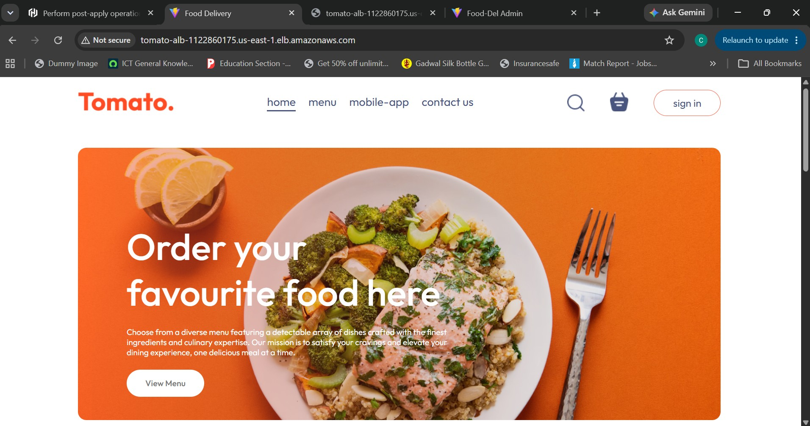
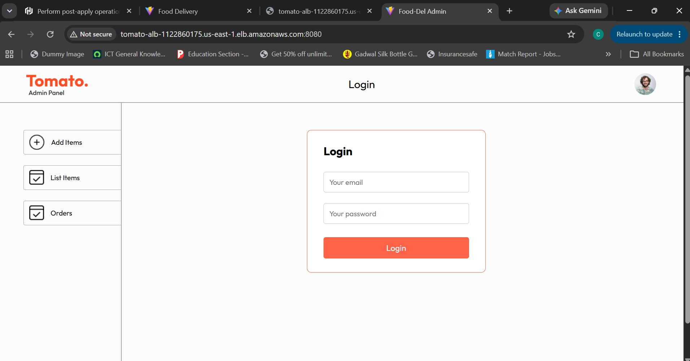
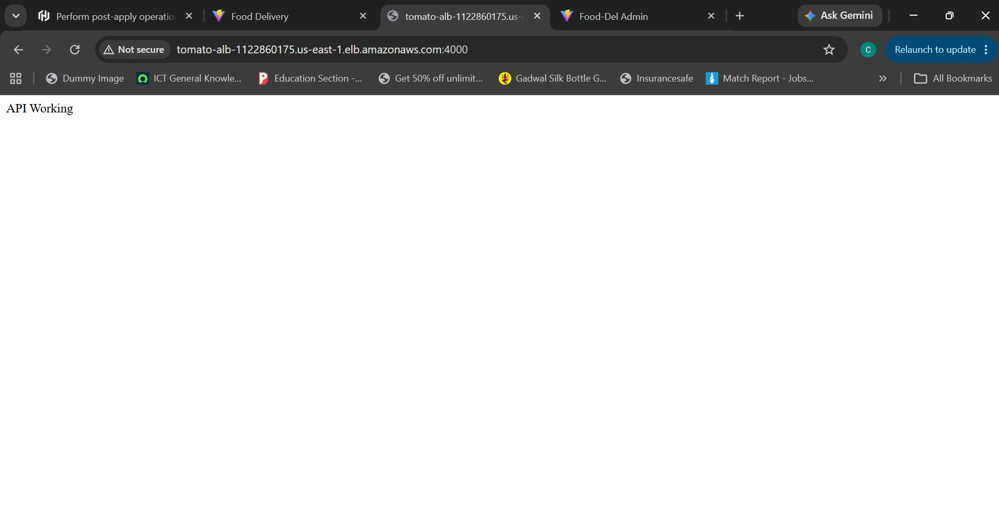
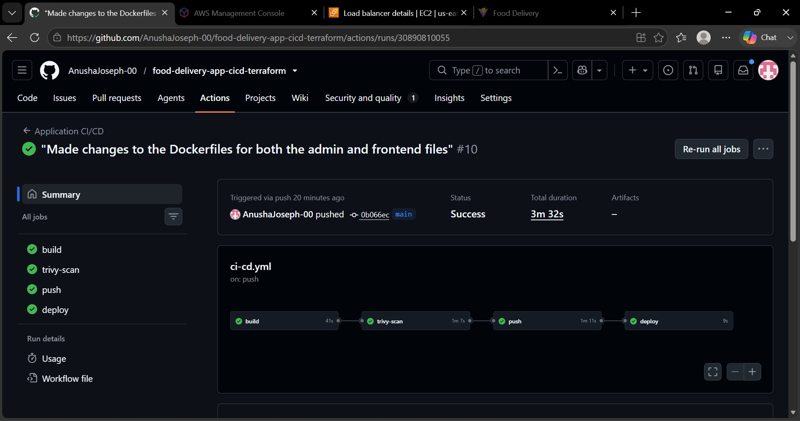
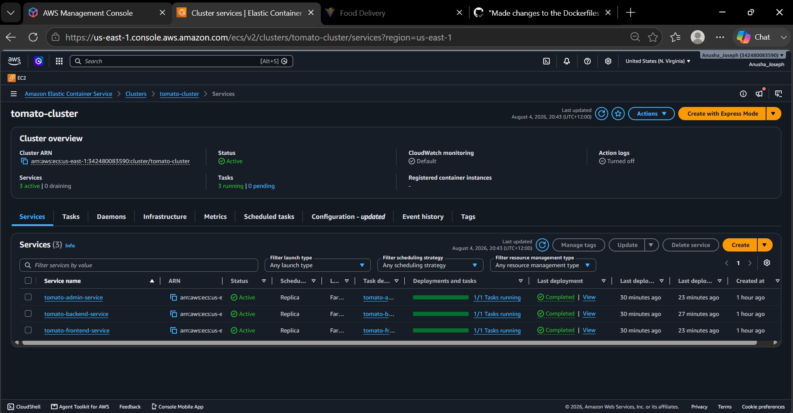
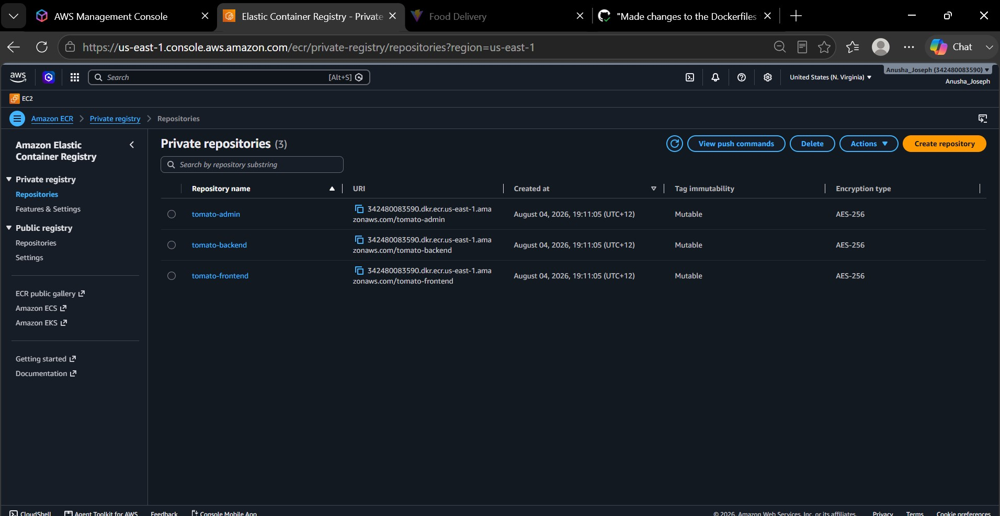
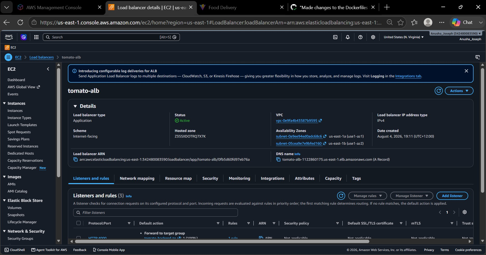
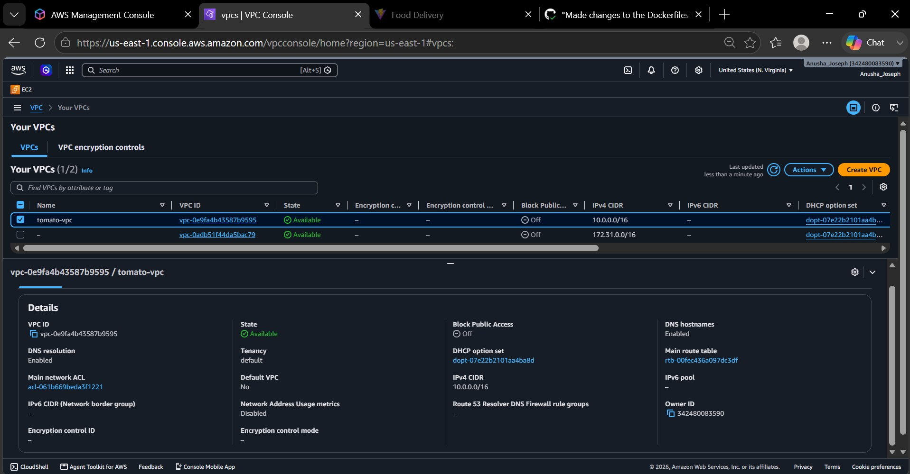
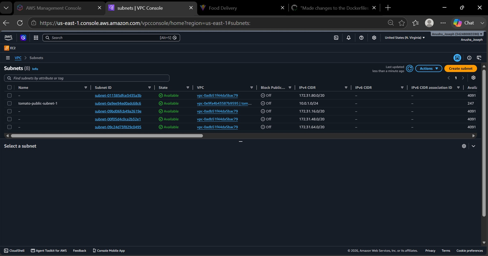
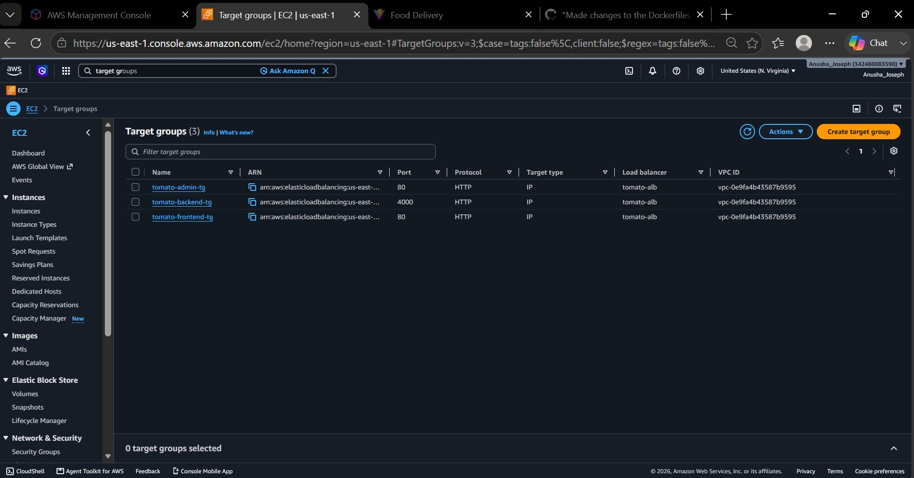

# Tomato - Food Delivery App | DevOps CI/CD Project

A full-stack food delivery application deployed on AWS using Terraform for infrastructure provisioning and GitHub Actions for CI/CD automation.

## Architecture Diagram

![Architecture Diagram]

## Tech Stack

| Category | Technology |
|---|---|
| Frontend | React 18 + Vite |
| Backend | Node.js + Express |
| Database | MongoDB Atlas |
| Containerisation | Docker |
| Registry | AWS ECR |
| Orchestration | AWS ECS Fargate |
| Load Balancer | AWS ALB |
| Infrastructure | Terraform |
| CI/CD | GitHub Actions |
| Security Scan | Trivy |

## Project Structure

```
food-delivery-app-cicd-terraform/
│
├── frontend/                    # React 18 + Vite customer app
│   ├── src/
│   └── Dockerfile
│
├── backend/                     # Node.js + Express REST API
│   ├── server.js
│   └── Dockerfile
│
├── admin/                       # React 18 + Vite admin panel
│   ├── src/
│   └── Dockerfile
│
├── terraform/                   # AWS Infrastructure as Code
│   ├── providers.tf
│   ├── variables.tf
│   ├── vpc.tf
│   ├── securitygroup.tf
│   ├── ecr.tf
│   ├── iam.tf
│   ├── ecs.tf
│   ├── alb.tf
│   └── outputs.tf
│
├──  .github/workflows/
│   └── cicd.yml                    # 4-stage CI/CD pipeline
│
├── .gitignore
└── README.md
```
## CI/CD Pipeline

| Stage | Job | Description |
|---|---|---|
| 1 | Build | Docker build all 3 images |
| 2 | Trivy Scan | Vulnerability scanning |
| 3 | Push | Push images to AWS ECR |
| 4 | Deploy | Update ECS Fargate services |

## AWS Infrastructure (Terraform)

| Resource | Name | Details |
|---|---|---|
| VPC | tomato-vpc | CIDR: 10.0.0.0/16 |
| Public Subnet 1 | tomato-public-subnet-1 | 10.0.1.0/24 - us-east-1a |
| Public Subnet 2 | tomato-public-subnet-2 | 10.0.2.0/24 - us-east-1b |
| Internet Gateway | tomato-igw | Attached to VPC |
| Security Group | tomato-alb-sg | Ports 80, 4000, 8080 |
| Security Group | tomato-ecs-sg | Traffic from ALB only |
| ECR Repository | tomato-frontend | React frontend image |
| ECR Repository | tomato-backend | Node.js backend image |
| ECR Repository | tomato-admin | React admin image |
| ECS Cluster | tomato-cluster | Fargate launch type |
| ECS Service | tomato-frontend-service | Port 80 |
| ECS Service | tomato-backend-service | Port 4000 |
| ECS Service | tomato-admin-service | Port 8080 |
| Load Balancer | tomato-alb | Public facing ALB |
| IAM Role | tomato-ecs-execution-role | ECS task execution |
| CloudWatch | /ecs/tomato-* | 7 day log retention |

## Screenshots

## 📸 Screenshots

### 🌐 Application
| Frontend | Admin Panel | Backend API |
|---|---|---|
|  |  |  |

### ⚙️ CI/CD Pipeline


### ☁️ AWS Infrastructure
| ECS Cluster | ECR Repositories |
|---|---|
|  |  |

| ALB Load Balancer | VPC |
|---|---|
|  |  |

| Subnets | Target Groups |
|---|---|
|  |  |

## Deployment Steps

### Prerequisites
- AWS CLI configured
- Terraform >= 1.5.0
- Node.js 18+

### 1. Clone the repo
```bash
git clone https://github.com/AnushaJoseph-00/food-delivery-app-cicd-terraform.git
cd food-delivery-app-cicd-terraform
```

### 2. Provision infrastructure

```bash
cd terraform
terraform init
terraform fmt
terraform validate
terraform plan
terraform apply
```

### 3. Add GitHub Secrets

AWS_ACCESS_KEY_ID
AWS_SECRET_ACCESS_KEY

### 4. Push to trigger pipeline

```bash
git push origin main
```

## Environment Variables

| Variable | Description |
|---|---|
| `MONGO_URL` | MongoDB Atlas connection string |
| `JWT_SECRET` | JWT authentication secret |
| `STRIPE_SECRET_KEY` | Stripe payment key |
| `PORT` | Backend server port (4000) |

## Cost Note
Infrastructure is designed to be created and destroyed: run `terraform destroy` after testing to avoid charges.

